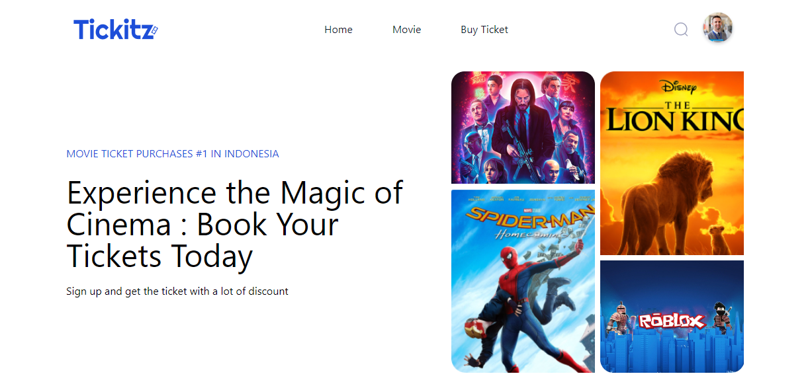

<h1 align="center">
  Tickitz App
</h1>

<p align="center"></p>

<p align="center">
    <a href="https://www.fazztrack.com/" target="blank">View Demo Project</a>
    ·
    <a href="https://github.com/guslizikri/Zwallet/issues" target="blank">Report Bug</a>
    ·
    <a href="https://github.com/guslizikri/Zwallet/pulls">Request Feature</a>
    ·
</p>

## About The Project

 <p>
 <strong>Tickitz App</strong> Lorem ipsum, dolor sit amet consectetur adipisicing elit. Ad placeat corrupti dolore blanditiis beatae iste natus, fuga quam. Eius maiores voluptate non id beatae temporibus praesentium repudiandae, impedit asperiores rem.
 </p>

## 🛠️ Installation Steps

1. Clone the repository

```bash
git clone https://github.com/guslizikri/tickitz-app.git
```

2. Install dependencies

```bash
npm install
# or
yarn install
```

3. Run the app

```bash
npm run dev
```

🌟 You are all set!

## 💻 Built with

- [![React][React.js]][React-url]
- [![Tailwind][Tailwind-CSS]][Tailwind-url]
- [![Redux][Redux]][Redux-url]

<hr>

## Website Interface

> 

<hr>
<p align="center">
Developed with ❤️ in Indonesia 	🇮🇩
</p>

<!-- MARKDOWN LINKS & IMAGES -->
<!-- https://www.markdownguide.org/basic-syntax/#reference-style-links -->

[React.js]: https://img.shields.io/badge/React-20232A?style=for-the-badge&logo=react&logoColor=61DAFB
[React-url]: https://reactjs.org/
[Tailwind-CSS]: https://img.shields.io/badge/tailwindcss-%2338B2AC.svg?style=for-the-badge&logo=tailwind-css&logoColor=white
[Tailwind-url]: https://tailwindcss.com/
[Redux]: https://img.shields.io/badge/redux-%23593d88.svg?style=for-the-badge&logo=redux&logoColor=white
[Redux-url]: https://redux.js.org/
